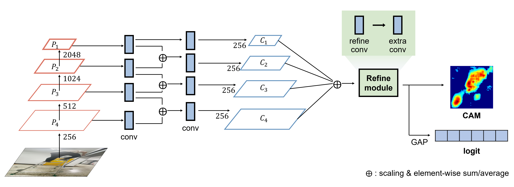

# SOS-CAM
Official implementation of Small Objects in construction Sites (SOS)-CAM.
> Jaehun Yang, Eunju Lee, Junehyoung Kwon, Doyeop Lee, Youngbin Kim, Chansik Park, and Dongmin Lee




## Getting Started


### Installation
We test our models under `python=3.8, pytorch=1.12.1, cuda=11.2`.

Clone this repository:
```bash
git clone https://github.com/EJLEE5826/SOS-CAM.git
```
Create a Python virtual environment:
```bash
conda create -n sosnet python=3.9
conda activate sosnet
```

Install other required packages with pip:
```bash
cd sosnet
pip install -r requirements.txt
```

### Training

```bash
python train_cls.py
```


## Acknowledgement

This implementation is built upon [DRS](https://github.com/qjadud1994/DRS). We thank the authors for releasing the codes.

